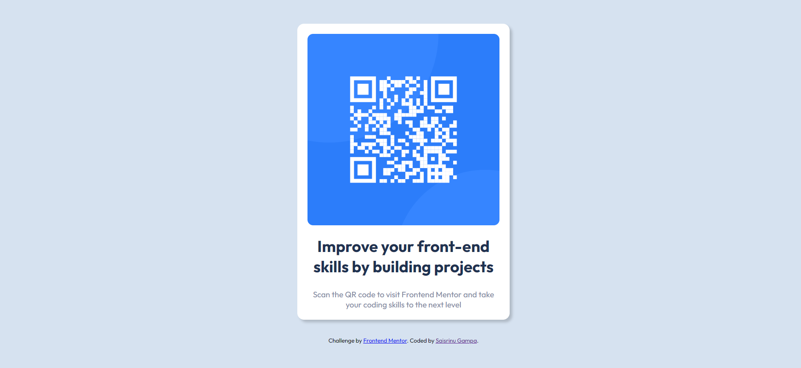

# Frontend Mentor - QR code component solution

This is a solution to the [QR code component challenge on Frontend Mentor](https://www.frontendmentor.io/challenges/qr-code-component-iux_sIO_H). Frontend Mentor challenges help you improve your coding skills by building realistic projects. 

## Table of contents

- [Overview](#overview)
  - [Screenshot](#screenshot)
  - [Links](#links)
- [My process](#my-process)
  - [Built with](#built-with)
  - [What I learned](#what-i-learned)
  - [Continued development](#continued-development)
- [Author](#author)

**Note: Delete this note and update the table of contents based on what sections you keep.**

## Overview

### Screenshot

### Links

- Solution URL: [Add solution URL here](https://your-solution-url.com)
- Live Site URL: [Add live site URL here](https://your-live-site-url.com)

## My process

### Built with

- HTML5 markup
- CSS custom properties
- Flexbox
- Media Queries

### What I learned

By the end fo this project I have learnt CSS Flexbox and how to write media queries.

### Continued development

I want to focus on the Media queries and Grid in future projects and improve my skills.

## Author

- Frontend Mentor - [@saisrinu135](https://www.frontendmentor.io/profile/saisrinu135)
- Twitter - [@saisrinu__sunny](https://www.twitter.com/saisrinu__sunny)
- Linkedin - [@saisrinu17][https://www.linkedin.com/in/saisrinu17/]
- Instagram - [@saisrinu__sunny][https://www.instagram.com/saisrinu__sunny/]